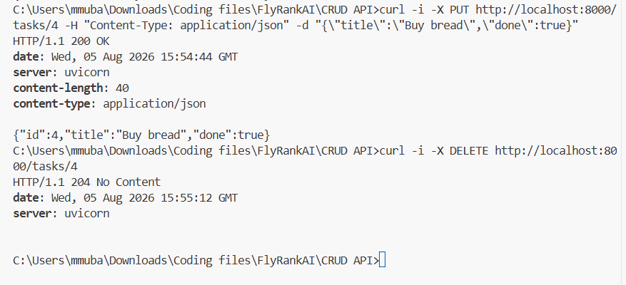

# CRUD API

A simple **CRUD (Create, Read, Update, Delete) REST API** built with **FastAPI** as part of the **FlyRank.AI Internship** assignment.

## Features

* Create a new task
* Retrieve all tasks
* Retrieve a task by ID
* Update an existing task
* Delete a task
* Input validation
* Proper HTTP status codes
* Interactive API documentation with Swagger UI

## Requirements

* Python 3.9 or later
* FastAPI
* Uvicorn

## Installation

### 1. Clone the repository

```bash
git clone https://github.com/mubashir72/CRUD-API
cd CRUD-API
```

### 2. Create a virtual environment

```bash
python -m venv venv
```

### 3. Activate the virtual environment

**Windows**

```bash
venv\Scripts\activate
```

**Linux/macOS**

```bash
source venv/bin/activate
```

### 4. Install dependencies

```bash
pip install fastapi uvicorn
```

### 5. Run the development server

```bash
python -m uvicorn main:app --reload
```

The API will be available at:

* **API:** http://127.0.0.1:8000
* **Swagger UI:** http://127.0.0.1:8000/docs
* **ReDoc:** http://127.0.0.1:8000/redoc

## API Endpoints

| Method | Endpoint      | Description             |
| ------ | ------------- | ----------------------- |
| GET    | `/`           | API information         |
| GET    | `/health`     | Health check            |
| GET    | `/tasks`      | Retrieve all tasks      |
| GET    | `/tasks/{id}` | Retrieve a task by ID   |
| POST   | `/tasks`      | Create a new task       |
| PUT    | `/tasks/{id}` | Update an existing task |
| DELETE | `/tasks/{id}` | Delete a task           |

## Example Request

### Create a Task

```bash
curl -X POST http://localhost:8000/tasks \
-H "Content-Type: application/json" \
-d "{\"title\":\"Buy milk\"}"
```

## Screenshots

### Swagger UI


### DELETE Request using curl



## Technologies Used

* Python
* FastAPI
* Uvicorn

## Project Structure

```text
CRUD-API/
│── main.py
│── README.md
│── image.png
└── image-1.png
```

## License

This project was created for the FlyRank.AI Internship assignment.
