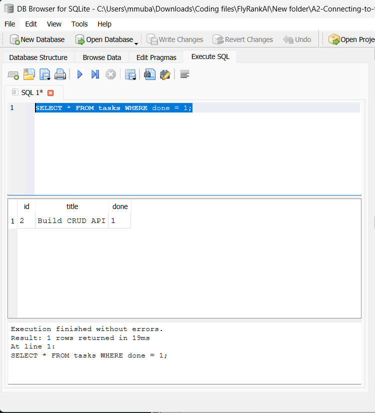
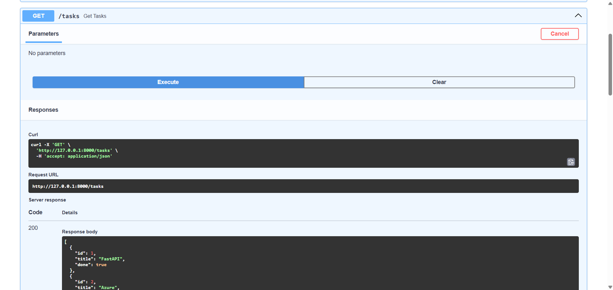

# A2 — Connecting to the Database

A **CRUD (Create, Read, Update, Delete) REST API** built with **FastAPI** and **SQLite** as part of the **FlyRank.AI Internship** assignment.

This project extends the previous CRUD API by replacing in-memory task storage with a persistent SQLite database. Tasks remain available after restarting the server.

## Features

* Create a new task
* Retrieve all tasks
* Retrieve a task by ID
* Update an existing task
* Delete a task
* SQLite database persistence
* Automatic database and table creation
* Automatic insertion of example tasks when the database is empty
* Input validation
* Proper HTTP status codes
* Interactive API documentation with Swagger UI

## Technologies Used

* Python
* FastAPI
* Uvicorn
* SQLite
* sqlite3

## Why SQLite?

**SQLite** was chosen because it is lightweight, simple to use, and does not require a separate database server.

The database is stored locally as a single file, making it suitable for this assignment and small applications. The application automatically creates the database and `tasks` table when it starts if they do not already exist.

## Database

The SQLite database file is:

```text
tasks.db
```

It is stored in the root directory of the project:

```text
A2-Connecting-to-the-database/
│── main.py
│── tasks.db
│── README.md
└── ...
```

The database contains a `tasks` table with:

| Column  | Type    | Description            |
| ------- | ------- | ---------------------- |
| `id`    | INTEGER | Primary key            |
| `title` | TEXT    | Task title             |
| `done`  | BOOLEAN | Task completion status |

If the table is empty when the application starts, three example tasks are automatically inserted.

## Requirements

* Python 3.9 or later
* FastAPI
* Uvicorn
* SQLite

SQLite does not require a separate installation because it is included with Python through the `sqlite3` module.

## Installation

### 1. Clone the repository

```bash
git clone https://github.com/mubashir72/A2-Connecting-to-the-database
cd A2-Connecting-to-the-database
```

### 2. Create a virtual environment

```bash
python -m venv venv
```

### 3. Activate the virtual environment

**Windows**

```bash
venv\Scripts\activate
```

**Linux/macOS**

```bash
source venv/bin/activate
```

### 4. Install dependencies

```bash
pip install fastapi uvicorn
```

### 5. Run the development server

```bash
python -m uvicorn main:app --reload
```

The application automatically creates `tasks.db` if it does not already exist.

The API will be available at:

* **API:** http://127.0.0.1:8000
* **Swagger UI:** http://127.0.0.1:8000/docs
* **ReDoc:** http://127.0.0.1:8000/redoc

## API Endpoints

| Method | Endpoint      | Description             |
| ------ | ------------- | ----------------------- |
| GET    | `/`           | API information         |
| GET    | `/health`     | Health check            |
| GET    | `/tasks`      | Retrieve all tasks      |
| GET    | `/tasks/{id}` | Retrieve a task by ID   |
| POST   | `/tasks`      | Create a new task       |
| PUT    | `/tasks/{id}` | Update an existing task |
| DELETE | `/tasks/{id}` | Delete a task           |

## Example Request

### Create a Task

```bash
curl -X POST http://localhost:8000/tasks ^
-H "Content-Type: application/json" ^
-d "{\"title\":\"Buy milk\"}"
```

The task is inserted directly into the SQLite database.

## Example SQL Query

The database can be opened using a SQLite database viewer such as **DB Browser for SQLite**.

One query executed during the assignment was:

```sql
SELECT * FROM tasks WHERE done = 1;
```

This query returns all completed tasks.

Other SQL operations practiced during the assignment include:

```sql
SELECT * FROM tasks;
```

```sql
SELECT COUNT(*) FROM tasks;
```

```sql
UPDATE tasks SET done = 1;
```

```sql
DELETE FROM tasks WHERE done = 1;
```

Changes made directly to the database are reflected by the API when the corresponding endpoints are called.

## Database Viewer Screenshot

The database was inspected using a SQLite database viewer.




## Swagger UI

The API can be tested interactively using Swagger UI.



## Project Structure

```text
A2-Connecting-to-the-database/
│── main.py
│── tasks.db
│── README.md
└── screenshots/
    ├── database-screenshot.png
    └── swagger.png
```

## Persistence

Unlike the previous in-memory CRUD API, tasks are now stored in SQLite.

For example:

```text
POST /tasks
       ↓
   SQLite
       ↓
    tasks.db
```

Because the data is stored in `tasks.db`, tasks remain available after restarting the FastAPI server.

## License

This project was created for the FlyRank.AI Internship assignment.
